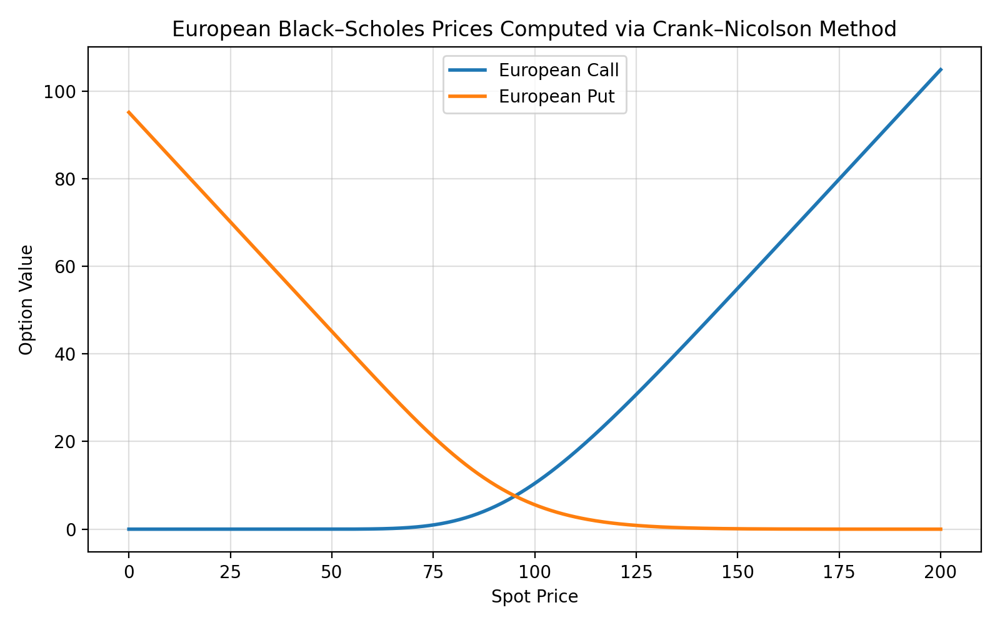

# Black Scholes PDE Solver

This project contains C++ implementation for solving the Black-Scholes Partial Differential Equation (PDE) for European Options and relatedly the Heat Equation, along with scripts and data for visualizing the solutions.

## Folder Structure

- `Black_Scholes_PDE.cpp`  
  C++ source code for solving the Black-Scholes PDE via Crank–Nicolson Scheme

- `Heat_Equation.cpp`  
  C++ source code for solving the Heat Equation via Crank–Nicolson Scheme

- `bs_prices.png`  
  Plot of Black-Scholes PDE solution.

- `heat_sol.png`  
  Plot of Heat Equation solution with initial condition $u(x,0) = sin(\pi x)$ and boundary condition $u(0,t)=u(1,t)=0$. The diffusion constant is set to 1/2. 

- `european_bs_call_solution.txt`  
  Numerical solution for European call option using the Black-Scholes PDE. 

- `european_bs_put_solution.txt`  
  Numerical solution for European put option using the Black-Scholes PDE.

- `heat_eq_sol.txt`  
  Numerical solution for the Heat Equation.

- `plot_BS_PDE_solution.ipynb`  
  Jupyter notebook for plotting Black-Scholes PDE results.

- `plot_heat_solution.ipynb`  
  Jupyter notebook for plotting Heat Equation results.

## How to Use

1. Compile the C++ source files to generate solutions.
2. Use the Jupyter notebooks to visualize the results from the `.txt` files.
3. Refer to the PNG files for example plots.

## Requirements

- C++ compiler (e.g., g++)
- Python (for Jupyter notebooks)
- Jupyter Notebook
- Matplotlib (for plotting in notebooks)

## Background: Solving the Black-Scholes PDE

The Black-Scholes Partial Differential Equation (PDE) is fundamental in quantitative finance for pricing European options. It is a PDE for the price $ V(S, t) $ of a European option and takes the following form

$$
\frac{\partial V}{\partial t} + \frac{1}{2} \sigma^2 S^2 \frac{\partial^2 V}{\partial S^2} + r S \frac{\partial V}{\partial S} - r V = 0
$$

where:
- \( S \) is the underlying asset price that follows a geometric Brownian motion ,
- \( t \) is time,
- \( $\sigma$ \) is the volatility,
- \( r \) is the risk-free interest rate,
- \( V(S, t) \) is the option price as a function of \( S \) and \( t \).

In this folder, the PDE is solved numerically using the Crank–Nicolson finite difference method, which is unconditionally stable and accurate for parabolic PDEs.

### Method Used

- **Discretization:** The asset price and time domains are discretized into grids.

- **Initial Condition:** The option payoff at maturity is set as the initial condition.

- **Boundary Conditions:** Appropriate boundary conditions are applied for the option type (call or put).

- **Crank–Nicolson Scheme:** The PDE is transformed into a system of linear equations at each time step, which is solved using a tridiagonal matrix algorithm.

- **Time Stepping:** The solution is evolved backward in time from maturity to the present.

This approach is also used for the Heat Equation, which shares mathematical similarities with the Black-Scholes PDE.

### Result

From the data in `european_bs_call_solution.txt` and `european_bs_put_solution.txt` we can graph the solution: 

# Future: Implement 2d PDE Solvers (eg. Heston PDE)

The Heston PDE is a 2d PDE that takes the following form 

The Heston PDE for the price \( V(S, v, t) \) of a European option is:

$$
\frac{\partial V}{\partial t}
+ \frac{1}{2} v S^2 \frac{\partial^2 V}{\partial S^2}
+ \rho \sigma v S \frac{\partial^2 V}{\partial S \partial v}
+ \frac{1}{2} \sigma^2 v \frac{\partial^2 V}{\partial v^2}
+ r S \frac{\partial V}{\partial S}
+ \kappa (\theta - v) \frac{\partial V}{\partial v}
- r V = 0
$$

where:
- \( S \) is the underlying asset price,
- \( v \) is the variance,
- \( t \) is time,
- \( r \) is the risk-free interest rate,
- \( $\kappa$ \) is the rate at which \( v \) reverts to \( $\theta$ \),
- \( $\theta$ \) is the long-term variance,
- \( $\sigma$ \) is the volatility of variance (vol of vol),
- \( $\rho$ \) is the correlation between the asset and its variance,
- \( V(S, v, t) \) is the option price as a function of \( S \), \( v \), and \( t \).

To solve the Heston PDE efficiently, the Alternating Direction Implicit (ADI) method is often used to handle the mixed derivative and multi-dimensional aspects. Rannacher smoothing can be applied at the initial time steps to improve accuracy when the payoff function is not smooth, helping to reduce numerical oscillations and improve numerical accuracy.